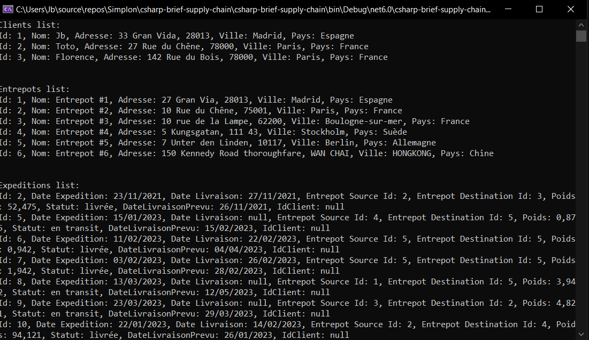

# Exercice Console C# .NET 6.0
* Gstion d'une base de donnée de manière simpliste avec PostgreSQL et Npgsql (Connexion, requêtes CRUD)
* Toutes les requêtes du brief sont dans le dossier sql du repo
 
### Contexte du projet
Dans un langage de programmation serveur de votre choix, créer des classes entités correspondantes aux tables de votre base de données.
* Ne pas utiliser d'ORM, partez avec une connexion standard à la BDD type JDBC (java), PDO (php), MysqlClient (c#) ou mysql2 (node.js)
* Créer des DAO/Repository pour les requêtes du CRUD ainsi que quelques requêtes spécifiques qui avaient été demandées
## Bonus
* Modifier la base de données pour ajouter des modes d'expédition (naval, aérien, ferroviaire, routier) qui aura leurs propres valeurs selon le type (par exemple le nombre de wagons et la compagnie pour le ferroviaire, le poids max pour l'aérien, ce genre de chose) mais aussi des valeurs communes (prix au km, émission C02 au kilo, un temps moyen au km)
* Gérer les relations d'une manière ou d'une autre dans les DAO
* Faire un DAO/Repository générique qui nous éviterait de répéter le  CRUD de base pour chaque entité

  
Console

  

----------
# Table entrepots
| id | nom_entrepot | adresse | ville | pays |
| -------- | -------- | -------- | -------- | -------- |
| 1 | Entrepot #1 | 27 Gran Via, 28013 | Madrid | Espagne
| 2 | Entrepot #2 | 10 Rue du Chêne, 75001 | Paris | France
| 3 | Entrepot #3 | 10 rue de la Lampe, 62200 | Boulogne-sur-mer | France
| 4 | Entrepot #4 | 5 Kungsgatan, 111 43 | Stockholm | Suède
| 5 | Entrepot #5 | 7 Unter den Linden, 10117 | Berlin | Allemagne
| 6 | Entrepot #6 | 150 Kennedy Road thoroughfare, WAN CHAI | HONGKONG | Chine
----------
# Table expeditions
| id | date_expedition | date_livraison | id_entrepot_source | id_entrepot_destination | poids | statut | date_livraison_prevu | id_client |
| -------- | -------- | -------- | -------- | -------- | -------- | -------- | -------- | -------- |
| 1 | 2022-12-04 | 2023-04-04 | 1 | 2 | 152.475 | livrée | 2023-01-25 | 2
| 2 | 2021-11-23 | 2021-11-27 | 2 | 3 | 52.475 | livrée | 2021-11-26 | null
| 3 | 2021-05-23 | 2021-05-27 | 2 | 2 | 02.475 | livrée | 2021-05-23 | 3
| 4 | 2023-02-21 | null | 3 | 4 | 07.275 | en transit | 2023-03-21 | 1
| 5 | 2023-01-15 | null | 4 | 5 | 00.875 | en transit | 2023-02-15 | null
| 6 | 2023-02-11 | 2023-02-22 | 5 | 5 | 00.942 | livrée | 2023-02-28 | null
| 7 | 2023-02-03 | 2023-02-26 | 5 | 5 | 01.942 | livrée | 2023-05-12 | null
| 8 | 2023-03-13 | null | 1 | 5 | 03.942 | en transit | 2023-03-29 | null
| 9 | 2023-03-23 | null | 3 | 2 | 04.821 | en transit | 2023-01-26 | null
| 10 | 2023-01-22 | 2023-02-14 | 2 | 4 | 94.121 | livrée | 2023-01-26 | null
| 11 | 2023-01-05 | 2023-01-14 | 2 | 4 | 194.121 | en transit | 2023-01-17 | null
| 12 | 2023-03-24 | null | 1 | 6 | 347.541 | en transit | 2023-04-17 | null
| 13 | 2023-04-04 | 2023-04-06 | 3 | 5 | 600.000 | livrée | 2023-04-05 | null
| 14 | 2023-04-01 | 2023-04-04 | 2 | 1 | 450.000 | livrée | 2023-04-04 | null
| 15 | 2023-03-27 | null | 2 | 6 | 1650.250 | en transit | 2023-05-24 | null
----------
# Table clients
| id | nom_entrepot | adresse | ville | pays |
| -------- | -------- | -------- | -------- | -------- |
| 1 | Jb | 33 Gran Vida, 28013 | Madrid | Espagne
| 2 | Toto | 27 Rue du Chêne, 78000 | Paris | France
| 3 | Florence | 10 rue de la Lampe, 62200 | Paris | France
----------
# Table expeditions_clients
| id_expedition | id_client |
| -------- | -------- |
| 3 | 1
| 4 | 2
| 1 | 3